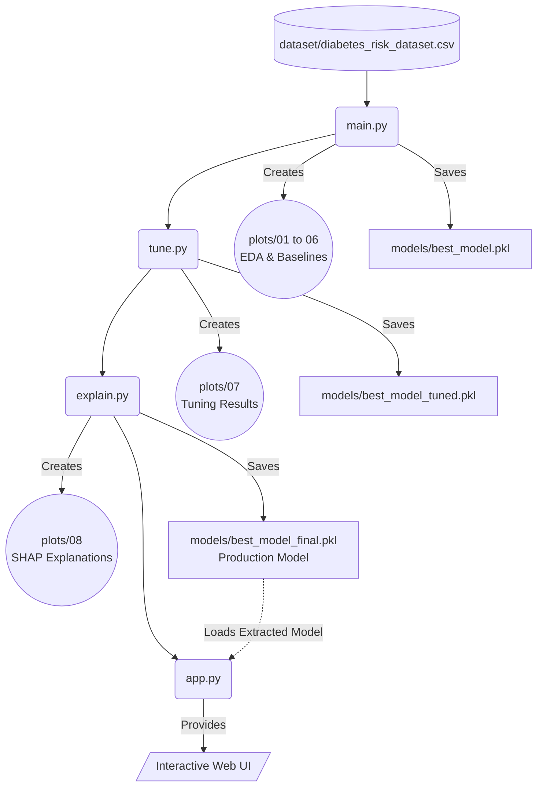

# Diabetes Risk Prediction


A comprehensive Machine Learning pipeline to predict diabetes risk, complete with Exploratory Data Analysis (EDA), intensive model training, hyperparameter tuning, advanced model explainability using SHAP, and a fully interactive **Streamlit Web UI**.

This project is authored by **Moiz Baloch**.

---

## ⚠️ Restricted License and Credits
**Author:** Moiz Baloch  
**Contact:** khanmoaiz682@gmail.com

**RESTRICTED LICENSE:** This project and its contents are strictly protected. Any use, reproduction, distribution, or modification without explicit prior written consent and proper attribution to Moiz Baloch is **strictly prohibited**. Please refer to the `LICENSE` file for full terms. 

---

## 📌 Project Architecture & Execution Flow

To successfully run the project and generate all models, plots, and insights, execute the scripts in the following order:



### High-Level Summary
1.  `main.py` -> Cleans data, performs EDA, trains 10 baseline models, and saves the best basic model.
2.  `tune.py` -> Runs Grid and Randomized Search Cross-Validation to optimize the baseline models and saves the best-tuned model.
3.  `explain.py` -> Finalizes a strongly-calibrated model (Logistic Regression), evaluates confidence distributions, and exports SHAP plots to explain *why* the model makes its decisions.
4.  `app.py` -> Launches a dynamic, user-friendly **Streamlit** Web UI that allows anyone to input patient data and instantly view the predicted risk, confidence, and exactly which factors drove that prediction via generated SHAP waterfall plots.

---

## 🚀 Detailed Execution Guide

### 1. `main.py` - EDA & Baseline Training
The first script to execute. It handles data preprocessing and broad exploratory analysis.

**Key Actions:**
*   **Data Cleaning:** Standardizes column names, removes duplicates, and performs outlier removal using Z-Scores (threshold = 3).
*   **EDA (Exploratory Data Analysis):** Generates and saves extensive plots into the `plots/` directory structure!
    *   `01_raw`: Initial distribution and count plots.
    *   `02_before_outlier_removal` & `03_after_outlier_removal`: Boxplots comparing distributions before and after applying Z-score drops.
    *   `04_correlation`: Heatmaps and bar charts correlating features with the target risk score.
    *   `05_category_analysis`: Pie charts, normalized heatmaps, and violin plots slicing data by Risk Category.
*   **Model Training:** Trains 10 diverse baseline models (Logistic Regression, Random Forest, SVM, KNN, Naive Bayes, Decision Tree, XGBoost, LightGBM, CatBoost, Neural Network).
*   **Evaluation:** Cross-validates models, stores confusion matrices in `plots/06_model_results`, and exports the best baseline model to `models/best_model.pkl`.

**Run Command:**
```bash
python main.py
```

### 2. `tune.py` - Hyperparameter Tuning
After assessing the baseline performances, this script optimizes the hyperparameters of top-tier models.

**Key Actions:**
*   **Data Pipeline:** Reconstructs the exact train/test splits generated in step 1 to prevent data leakage.
*   **Hyperparameter Search:**
    *   Uses `GridSearchCV` for exhaustive searches on models with smaller parameter spaces (Logistic Regression, SVM, Neural Network).
    *   Uses `RandomizedSearchCV` for complex tree-boosted models to save computation time (Random Forest, XGBoost, LightGBM, CatBoost).
*   **Comparison:** Generates an "After vs Before" accuracy bar chart showing the performance gains from tuning (saved to `plots/07_tuning_results`).
*   **Export:** Evaluates tuned confusion matrices and exports the absolute best tuned model to `models/best_model_tuned.pkl`.

**Run Command:**
```bash
python tune.py
```

### 3. `explain.py` - SHAP Analysis & Confidence Scoring
The final step focuses strictly on model interpretability, calibration, and production readiness.

**Key Actions:**
*   **Model Finalization:** Selects finely-tuned **Logistic Regression** due to its natively calibrated probability outputs (predict_proba), establishing high reliability over SVMs.
*   **Confidence Scoring:** Calculates and plots exactly how confident the model is for each prediction, separating predictions into confident, borderline, etc. (Saved to `plots/08_shap/confidence_distribution.png`).
*   **SHAP Analysis:** 
    *   **Global Importance:** Ranks the features by their mean absolute SHAP value for each Risk Category.
    *   **Beeswarm Plots:** Summarizes complex interactions between features and target prediction likelihood.
    *   **Waterfall Plots:** Isolates single-patient predictions and plots a cascading visual showing exactly which features pushed the risk score up or down.
*   **Production Export:** Saves the ultimately explainable, calibrated model and metadata as `models/best_model_final.pkl`. Includes a `predict_patient()` helper function ready for API or frontend integration.

**Run Command:**
```bash
python explain.py
```

---

### 4. `app.py` - Web Interface / Interactive Web UI
The final piece of the pipeline. It brings your model into the real world with a graphical web application.

**Key Actions:**
*   **Predictive Dashboard:** Takes manual user input from the sidebar (patient demographics, lifestyle, and lab results).
*   **Live Predictions:** Loads the `best_model_final.pkl` and corresponding scaler/encoders to predict risk dynamically on the fly.
*   **Visual Interpretability:** Immediately generates probability breakdown bars and localized SHAP Waterfall charts within the browser to visually explain exactly why a specific risk was assigned.
*   **Alerts & Triage:** Highlights high vs. borderline vs. low risk predictions cleanly and beautifully to replicate a production software feel.

**Run Command:**
```bash
streamlit run app.py
```

---

## 📂 Directory Structure

```text
Diabetes Prediction/
│
├── dataset/
│   └── diabetes_risk_dataset.csv       # Raw medical dataset
│
├── plots/                              # Auto-generated by scripts
│   ├── 01_raw/
│   ├── 02_before_outlier_removal/
│   ├── 03_after_outlier_removal/
│   ├── 04_correlation/
│   ├── 05_category_analysis/
│   ├── 06_model_results/
│   ├── 07_tuning_results/
│   └── 08_shap/                        # Advanced Explainability graphs
│
├── models/                             # Auto-generated serialized files
│   ├── best_model.pkl                  # From main.py
│   ├── best_model_tuned.pkl            # From tune.py
│   ├── best_model_final.pkl            # From explain.py (Production Ready)
│   ├── scaler.pkl
│   ├── label_encoder.pkl
│   └── feature_names.pkl
│
├── main.py                             # 1st executable
├── tune.py                             # 2nd executable
├── explain.py                          # 3rd executable
├── app.py                              # 4th executable (Streamlit UI)
│
├── README.md                           # Project Documentation
└── LICENSE                             # Restricted License
```

---

## 🛠️ Setup & Requirements

Make sure you have a Python 3.8+ environment. Install the necessary packages before running:

```bash
pip install pandas numpy matplotlib seaborn scipy scikit-learn xgboost lightgbm catboost shap joblib streamlit
```

To fully execute the pipeline, simply navigate to the workspace directory and execute the primary python files synchronously as strictly ordered.

```bash
python main.py
python tune.py
python explain.py
streamlit run app.py
```
